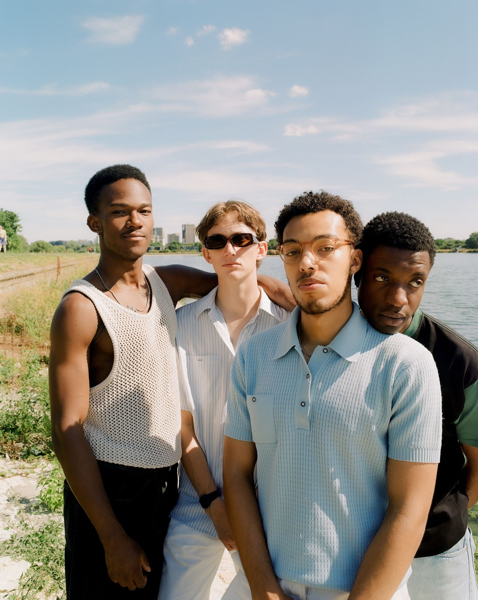
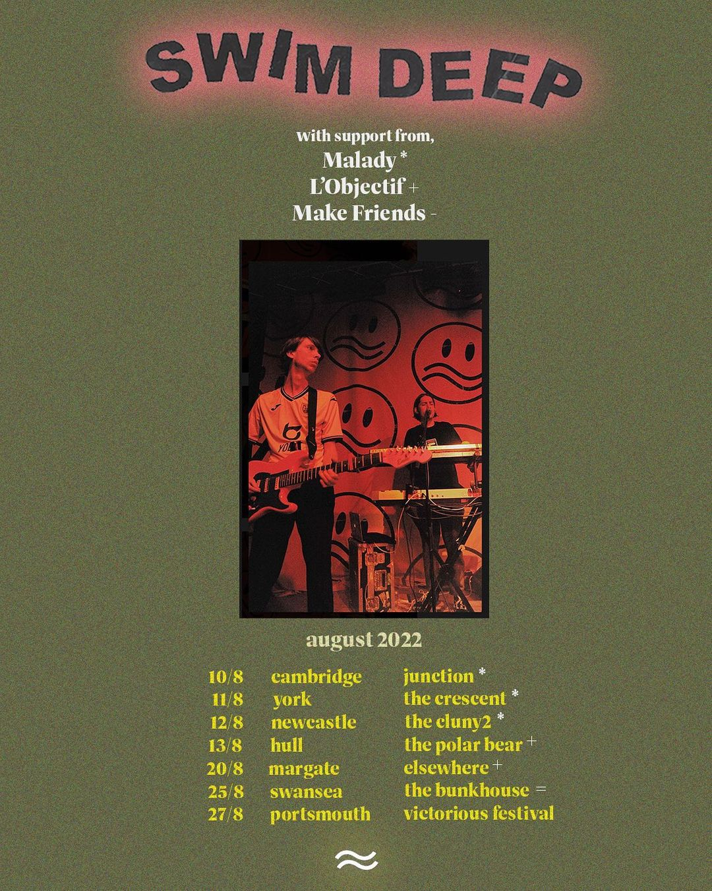
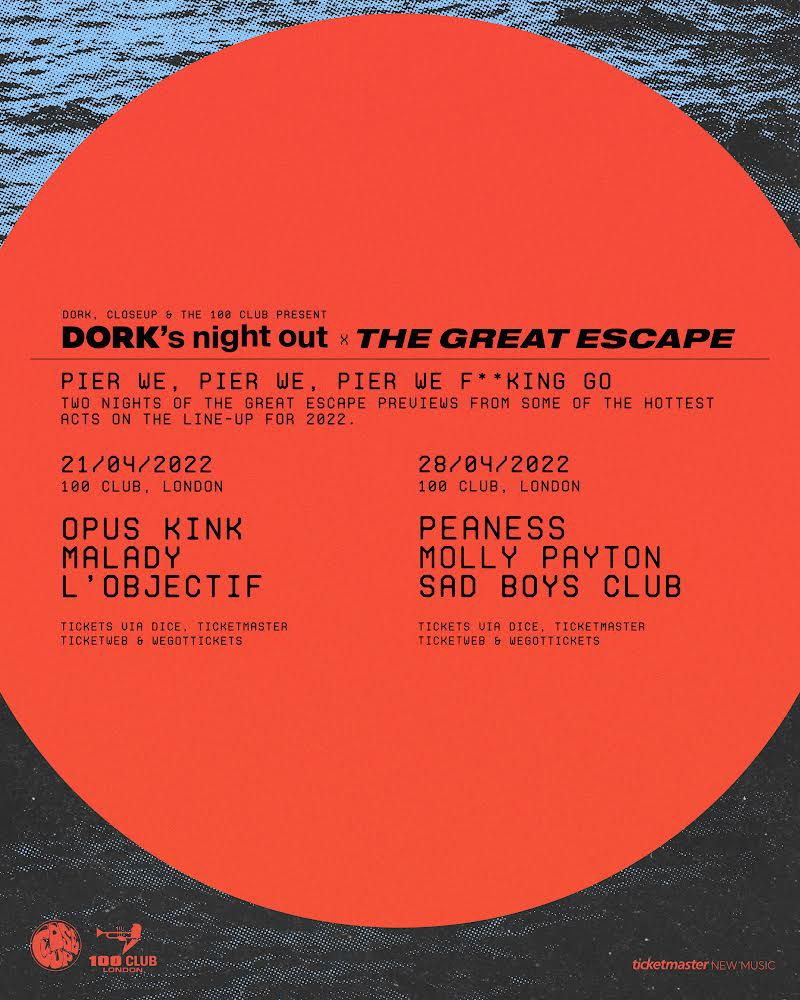
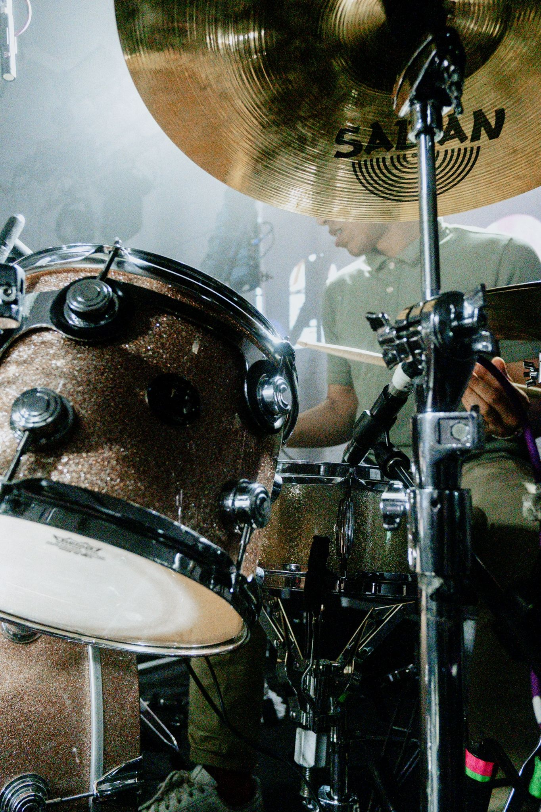

Between 2021 and 2023, I was a member of Indie/Electronic band Malady. 

## Live
Malady supported Sam Akpro, Swim Deep and Wet Leg, among others. We also played live shows at Fabric, SGW3, and more. I played drums/electronics, and (w/ Charlie Clark) provided musical direction for the band's live show.

<!-- (Add A full list of my recent gigs can be found on the [gigs page...]) -->

## Studio
In 2022, Malady released 'Round the Bend' on Nice Swan (English Teacher, Jelly Cleaver, Prima Queen). The single recieved a [remix](https://niceswanrecords.bandcamp.com/track/round-the-bend) from Manchester legends 808 State. 

In early 2023, with support from [Modern Sky](https://www.modernsky.uk). Malady released ['All Pressure No Diamonds'](https://malady.lnk.to/AllPNoD). The EP was written and recorded together, first at Charlie's flat in East London, and then with Andy Savours (My Bloody Valentine, Black Country New Road).

## Press
The band often recieved press from outlets such as [NME](https://www.nme.com/features/music-features/guitar-bands-interview-umlauts-pva-courting-radar-3257707) and [DIY Mag](https://diymag.com/review/ep/malady-all-pressure-no-diamonds).
We also participated in ad campaigns with Fred Perry, Shure and Percival menswear.

## Leaving

In 2023, I decided to leave the band in order to focus on research and my own musical practice. The band in its current iteration constists of Charlie, Percy, Khaleem and a drum machine.

## Archive

<!-- [images from those shoots, black dog cover, ep cover, hyperreal images] -->

<figure>
    

        

            
            

        

            
            

        

</figure>
<figure>
    

        

            
            

        

            
            

        

</figure>
<figure>
    

        

            
            

        

            
            

        

            
            

        

</figure>
